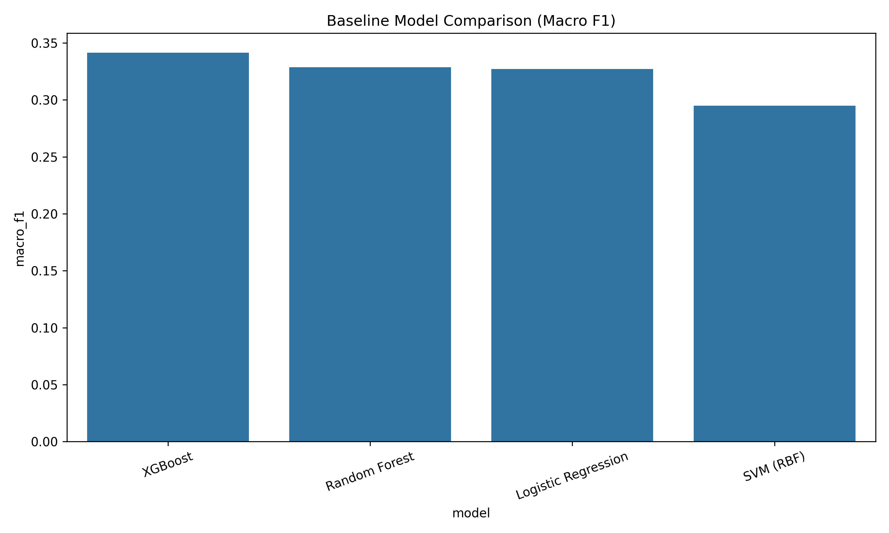
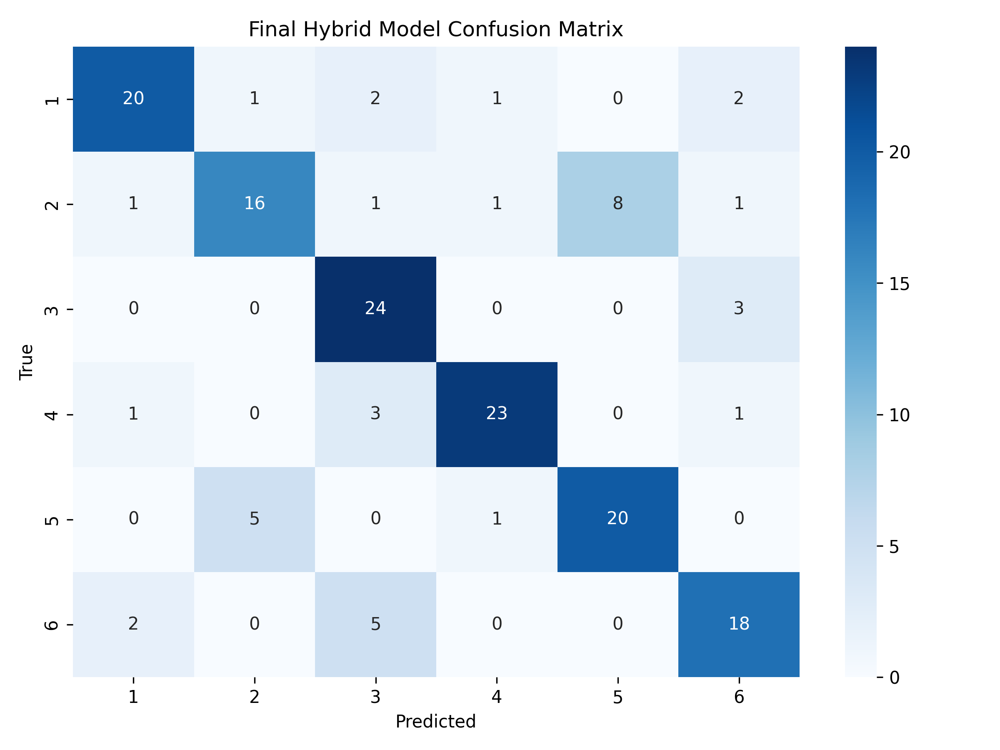

# Persian Personality Prediction from Text

A hybrid deep learning system for predicting personality traits from Persian text, combining stylistic/lexical features with ParsBERT semantic embeddings. Developed as part of an M.Sc. thesis in Artificial Intelligence and Robotics.

**Author:** Neda Javadi — [GitHub](https://github.com/nedajavadi) · [ORCID](https://orcid.org/0009-0005-3575-6777)

---

## Key contributions

- A **stacked hybrid architecture** (stylistic features + ParsBERT embeddings → RF/LR base learners → XGBoost meta-classifier) that **more than doubles** macro F1 over the best classical ML baseline on Persian personality prediction.
- A systematic comparison of four classical baselines against Transformer-based semantic representations, with permutation-importance analysis showing exactly where the performance gain comes from.
- A fully built (prompt-engineered, JSON-parsed) pipeline for LLM-based pseudo-labeling of unlabeled Persian text, laying the groundwork for a semi-supervised extension.

## Headline result

| Model | Accuracy | Macro F1 |
|---|---|---|
| Best classical baseline (XGBoost, stylistic features only) | 35.0% | 34.2% |
| **Hybrid model — style features + ParsBERT, stacked ensemble** | **75.6%** | **75.4%** |
| Hybrid model, 5-fold cross-validation (mean ± std) | — | 80.6% ± 2.4% |

Adding ParsBERT's contextual semantic representations to a stacked ensemble more than **doubles** macro F1 over the best classical baseline. Permutation importance confirms ParsBERT embedding dimensions drive nearly all of the model's predictive power — the hand-crafted stylistic features contribute comparatively little on their own.




## Problem

Personality detection from text is well studied in English but remains limited in Persian, primarily due to the scarcity of labeled data and native pretrained language models. This project tackles the problem in three parts:

1. Build strong supervised baselines on a labeled Persian personality dataset.
2. Show that Transformer-based semantic representations (ParsBERT) substantially outperform hand-crafted stylistic/lexical features for this task.
3. Investigate whether a large language model can generate usable pseudo-labels on unlabeled Persian text, to extend the training set under a semi-supervised setup (**in progress — see "Status & roadmap"**).

The target is a personality label with 6 classes, trained on 800 labeled Persian samples (roughly balanced, ~131–139 per class), with a held-out validation/test split.

## Datasets

| Dataset | Role | Size |
|---|---|---|
| [Persian Personality Prediction v1800](https://www.kaggle.com/datasets/heidarpour/persian-personality-prediction-v1800) (Kaggle) | Labeled data — train / val / test | 800 / 200 / 800 |
| [Kamtera Persian Conversational Dataset](https://huggingface.co/datasets/Kamtera/Persian-conversational-dataset) (Hugging Face) | Unlabeled pool, intended for LLM pseudo-labeling | 107,280 raw → 78,805 after cleaning |

## Method

**Feature engineering** (`01_preprocessing.ipynb`, `02_feature_extraction.ipynb`)
Persian-specific text normalization (Hazm), followed by 24 stylistic/lexical features: lexical diversity, sentence length, punctuation counts, sentiment-proxy word counts, first-person/social-word ratios, certainty/uncertainty markers, and more.

**Semantic representations** (`04_bert_embeddings.ipynb`)
768-dimensional ParsBERT sentence embeddings via mean pooling over token representations.

**Baselines** (`03_baseline_models.ipynb`)
Logistic Regression, SVM (RBF), Random Forest, and XGBoost trained on stylistic features only, with stratified cross-validation and class-balanced weighting.

**Hybrid stacking model** (`05_Hybrid_Model.ipynb`)
Style features and ParsBERT embeddings feed a stacked ensemble (Random Forest and Logistic Regression base learners, XGBoost fusion) topped with a logistic meta-classifier. Evaluated with 5-fold cross-validation and permutation-based feature importance.

**LLM pseudo-labeling** (`03_5_llm_labeling_kamtera.ipynb`)
A structured Persian prompt asks an LLM to score the Big Five dimensions (1–5) with a confidence score, returned as JSON, for unlabeled conversational text. See "Status & roadmap" for where this currently stands.

## Repository structure

```
data/            raw and processed datasets
notebooks/       01-07, run in order (see below)
models/          trained model artifacts
results/         metrics, classification reports, confusion matrices, plots
```

| # | Notebook | Purpose |
|---|---|---|
| 01 | `01_preprocessing.ipynb` | Clean/normalize text, extract basic style features, split data |
| 02 | `02_feature_extraction.ipynb` | Extract the 24-dim stylistic feature set |
| 03 | `03_baseline_models.ipynb` | Train and compare classical ML baselines |
| 03.5 | `03_5_llm_labeling_kamtera.ipynb` | LLM pseudo-labeling pipeline for unlabeled data |
| 04 | `04_bert_embeddings.ipynb` | Extract ParsBERT embeddings |
| 05 | `05_Hybrid_Model.ipynb` | Train and evaluate the final hybrid stacking model |
| 06 | `06_final_analysis.ipynb` | Consolidate and analyze results |
| 07 | `07_inference_demo.ipynb` | Run the trained model on new text |

## Status & roadmap

This project is under active development. Two parts of the intended design are not yet complete, documented here for full transparency:

**1. LLM pseudo-labeling has not yet been run against a real LLM.**
The pipeline — prompt template, JSON parsing, confidence scoring — is fully built, but the actual API call is currently a placeholder. The file used during development contains randomly generated values for testing the code path, not real model annotations. As a direct result, the headline hybrid-model results above use style + ParsBERT features only; no LLM-derived features are included yet.

**2. The Kamtera dataset needs re-evaluation for this task.**
A review of its actual content shows it consists largely of short legal/administrative questions (e.g., insurance claims, inheritance disputes, contract issues) rather than personal, expressive conversational text — it's better suited to legal Q&A systems than personality inference. Before running LLM pseudo-labeling at scale, this project needs either a more suitable unlabeled Persian conversational corpus, or a validated case for why legal-domain text still carries usable personality signal.

**Planned next steps:**
- Identify or construct an unlabeled Persian corpus of genuinely personal/conversational text.
- Run real LLM labeling on that corpus using the existing prompt template.
- Retrain the hybrid model with LLM-derived pseudo-labels included, and directly compare against the current style+ParsBERT-only results to measure the true effect of semi-supervised augmentation.

## Requirements

```
python>=3.10
pandas
numpy
scikit-learn
xgboost
torch
transformers
hazm
tqdm
matplotlib
seaborn
joblib
```

## How to run

1. Place raw data under `data/raw/`: `train.csv` and `test.csv` (Persian Personality Prediction v1800), `Kamtera.json` (Kamtera dataset).
2. Run the notebooks in order, 01 → 07.
3. Trained models and evaluation artifacts are written to `models/` and `results/`.

## License

See [LICENSE](LICENSE).
